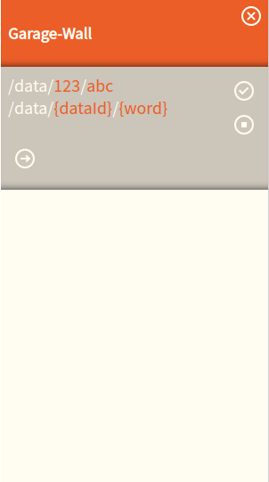

# Garage Wall :tennis:


[](https://travis-ci.org/snrn-Pontus/garage-wall)
[](https://david-dm.org/snrn-Pontus/garage-wall?type=dev)
[](https://david-dm.org/snrn-Pontus/garage-wall?type=peer)

```javascript
import react from 'react';
import { GarageWall } from 'garage-wall';

const App = () => {
  return (
    <div>
      <GarageWall
        mock={new MockBuilder().onGet(
          { '{dataId}': '\\d+', '{word}': '\\w+' },
          `/data/{dataId}/{word}`,
          (config, routeParams, urlPattern) => {
            return {
              routeParams,
              urlPattern,
              data: { boatsman: 'tjorven' },
              status: 200,
              statusText: 'ok',
              headers: {},
              config: config,
              request: null,
            };
          }
        )}
      />
    </div>
  );
};

ReactDOM.render(<App />, document.getElementById('root'));
```


